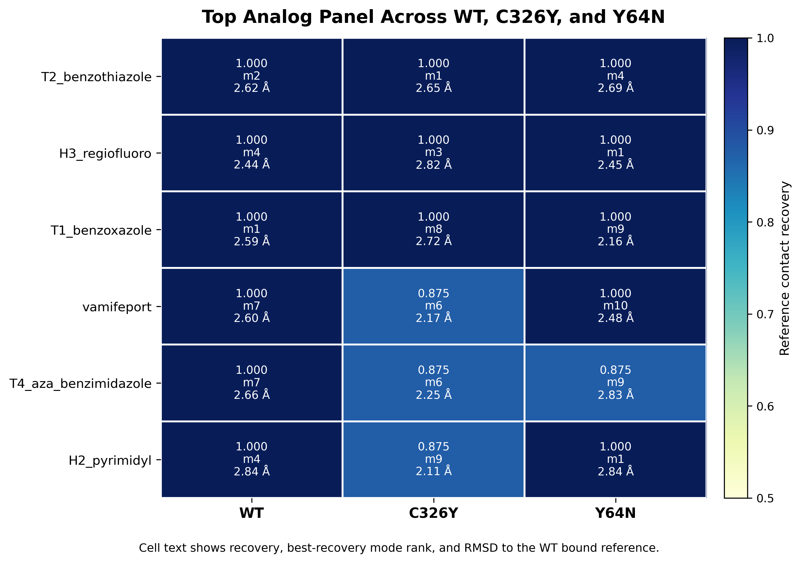

## Project question

- Can vamifeport-like small molecules preserve a plausible inhibitor-like binding mode in `C326Y` and `Y64N`?
- The main optimization target is mutation tolerance in `C326Y`.
- `WT` is kept as the mechanistic anchor because it contains the only experimentally grounded inhibitor binding pattern.

::: notes
Open with the molecular question, not the disease background. The logic is to test whether a known ferroportin inhibitor scaffold can survive the pocket changes introduced by the two selected mutations, especially C326Y.
:::

## Workflow overview

{width=100%}

- The workflow is sequential: structure selection, mutation modeling, WT validation, restrained production preparation, analog design, cross-state docking, and ranking.
- Each later step depends on the earlier step being defensible.

::: notes
Emphasize that this was not a broad virtual screen. The workflow was intentionally controlled so that the analog ranking would be interpretable.
:::

## Receptor states

{width=100%}

- `WT` anchors the known inhibitor interaction pattern.
- `C326Y` is the hardest mutant and the main ranking priority.
- `Y64N` tests whether the conclusions are broader than a single mutation.

::: notes
Point out that residue 64 changes from Tyr to Asn in Y64N, and residue 326 changes from Cys to Tyr in C326Y. The point of the panel is to show that these are local pocket perturbations rather than random sequence changes.
:::

## WT validation

{width=92%}

- Validation asked whether the docking workflow could reproduce the experimental vamifeport pose in `8C03`.
- The final retained setup used the `current_linker_protonated` ligand state.
- The selected WT validation box was `box_084_ex16`.
- Final WT validation result: top-ranked pose RMSD `2.084 Å`, reference contact recovery `1.0`.

::: notes
This is the figure that justifies doing any analog ranking at all. The important point is not only that a near-native pose exists, but that the retained setup ranks a chemically sensible pose at the top.
:::

## Production receptor preparation

| State | Heavy-atom RMSD after restrained minimization (Å) | Flexible side-chain heavy atoms |
|---|---:|---:|
| `WT` | `1.048` | `101` |
| `C326Y` | `1.044` | `107` |
| `Y64N` | `1.045` | `97` |

- Production receptors were prepared separately from the WT validation receptor.
- Restrained minimization cleaned modeled side chains without breaking the experimental pocket geometry.
- Backbone heavy atoms stayed restrained, while pocket side chains were allowed to relax.

::: notes
The message here is that we did not compare raw mutant models directly. The production set was cleaned under the same protocol so that WT versus mutant comparisons were fair.
:::

## Parent benchmark across WT and mutants

| State | Top pose RMSD (Å) | Top contact recovery | Best RMSD pose rank | Best RMSD (Å) |
|---|---:|---:|---:|---:|
| `WT` | `3.376` | `0.75` | `9` | `0.966` |
| `C326Y` | `3.457` | `0.125` | `9` | `1.976` |
| `Y64N` | `3.200` | `0.625` | `12` | `2.175` |

- The parent benchmark identified `C326Y` as the most disruptive state.
- `WT` still supports a near-native inhibitor-like pose.
- `Y64N` is perturbed, but less severely than `C326Y`.

::: notes
This slide explains why the final ligand ranking was intentionally C326Y-biased. The parent scaffold itself already told us which mutant was the hardest discriminator.
:::

## Analog design strategy

{width=100%}

- The analog set was a focused first-round SAR panel rather than a broad virtual screen.
- Each analog was designed as a single major edit to keep the interpretation simple.
- The main editable regions were the headgroup, central core, protonated linker, and distal fused heteroaryl tail.

::: notes
Frame this as a hypothesis-driven medicinal chemistry exercise. Each analog tests one main question, such as whether the distal donor matters or whether the headgroup geometry is more flexible than expected.
:::

## Ranking logic

- The workflow did not rank ligands by docking score alone.
- For each ligand-state pair, the key pose was the **best-recovery pose**, selected by:
  1. highest reference contact recovery
  2. lower RMSD
  3. better docking score
  4. better mode rank
- A state counted as supported only if:
  - contact recovery `>= 0.875`
  - RMSD `<= 2.85 Å`
  - best-recovery mode rank `<= 10`
- Final ranking prioritized `C326Y` support before the other states.

::: notes
This is the conceptual core of the results. The ranking asks which ligands preserve a known inhibitor-like binding pattern while tolerating the mutant receptor, not which ligands happen to get the most favorable raw score.
:::

## Ranked results

{width=88%}

- The heatmap summarizes reference contact recovery, best-recovery mode rank, and RMSD for the top panel.
- `T2_benzothiazole`, `H3_regiofluoro`, and `T1_benzoxazole` all outperform or match the parent under the cross-state ranking logic.
- `T2_benzothiazole` is the cleanest broad lead because it is fully supported across `WT`, `C326Y`, and `Y64N`.

::: notes
Walk the audience through the first three rows only. The most important point is that the best-ranked analogs do not just score well; they retain the reference contact shell and survive the mode-rank filter in the hardest mutant.
:::

## Top ranked structures

{width=82%}

- `T2_benzothiazole` is the best tail optimization result.
- `H3_regiofluoro` is the best headgroup optimization result.
- `T1_benzoxazole` is the best backup comparator from the same tail region.

::: notes
This slide is mainly a chemistry slide. Keep the explanation short and tie each ligand back to its edited region.
:::

## C326Y structural comparison

{width=100%}

- The overlay focuses on the hardest mutant state.
- The top analogs preserve a plausible inhibitor-like pose in the `C326Y` pocket.
- This figure is the best structural argument for why the top-ranked analogs matter relative to the parent scaffold.

::: notes
Use this slide to explain the meaning of mutation tolerance. It is not just the absence of steric clashes; it is preservation of a believable binding geometry in the mutated pocket.
:::

## Main conclusions

- The workflow supports a mutation-aware small-molecule inhibitor strategy around the vamifeport scaffold.
- `C326Y` is the most useful discriminator for this series.
- The distal fused tail is the most productive first optimization region.
- Headgroup geometry is somewhat tunable.
- The best short list for the next step is:
  1. `T2_benzothiazole`
  2. `H3_regiofluoro`
  3. `T1_benzoxazole`

::: notes
Keep the close focused on what the docking stage can justify. Do not overclaim potency or therapeutic effect.
:::

## Key project files

| File | Purpose |
|---|---|
| `report/workflow_results_report.qmd` | full technical report |
| `results/tables/final_ranked_hits.csv` | final ranked summary |
| `results/tables/analog_cross_state_summary.csv` | per-state ligand summary |
| `results/tables/analog_library_manifest.csv` | exact analog identities and rationale |
| `scripts/presentation_mutation_scenes.pml` | mutation figure scene |
| `scripts/presentation_validation_pose_overlay.pml` | validation figure scene |
| `scripts/presentation_c326y_top_hits_overlay.pml` | `C326Y` overlay scene |

::: notes
This slide makes the repository easy to hand off. It tells teammates exactly where to look after the meeting.
:::
