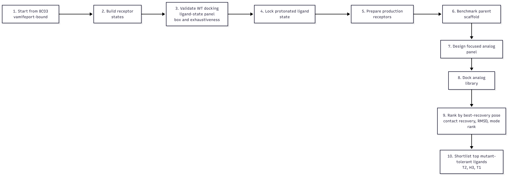
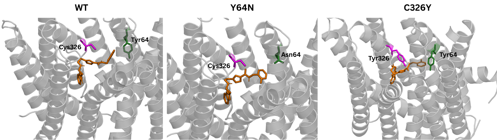
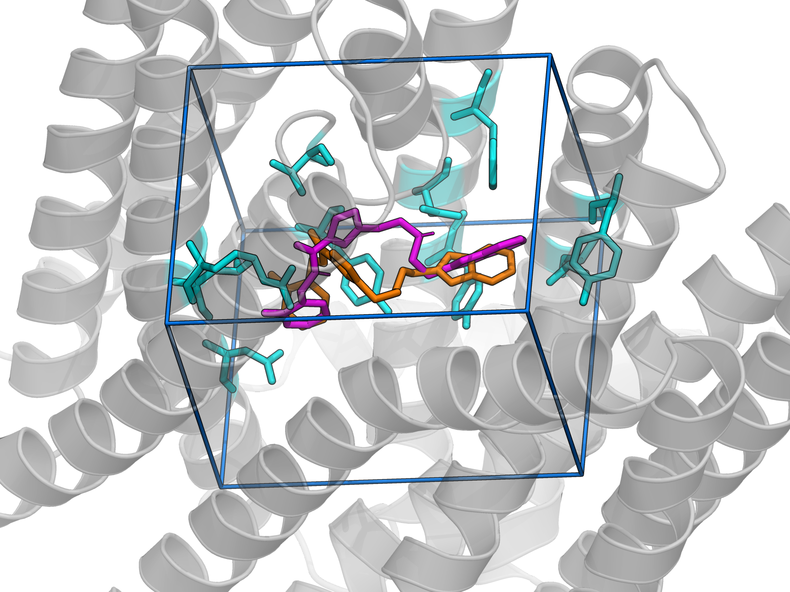
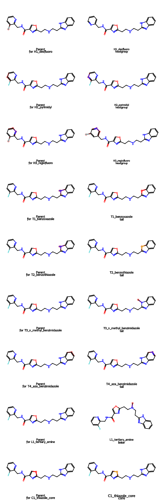
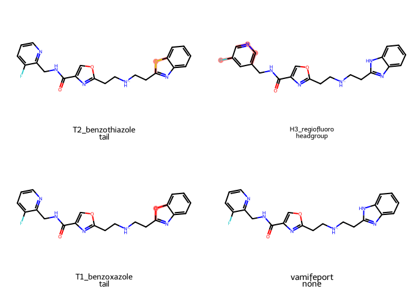
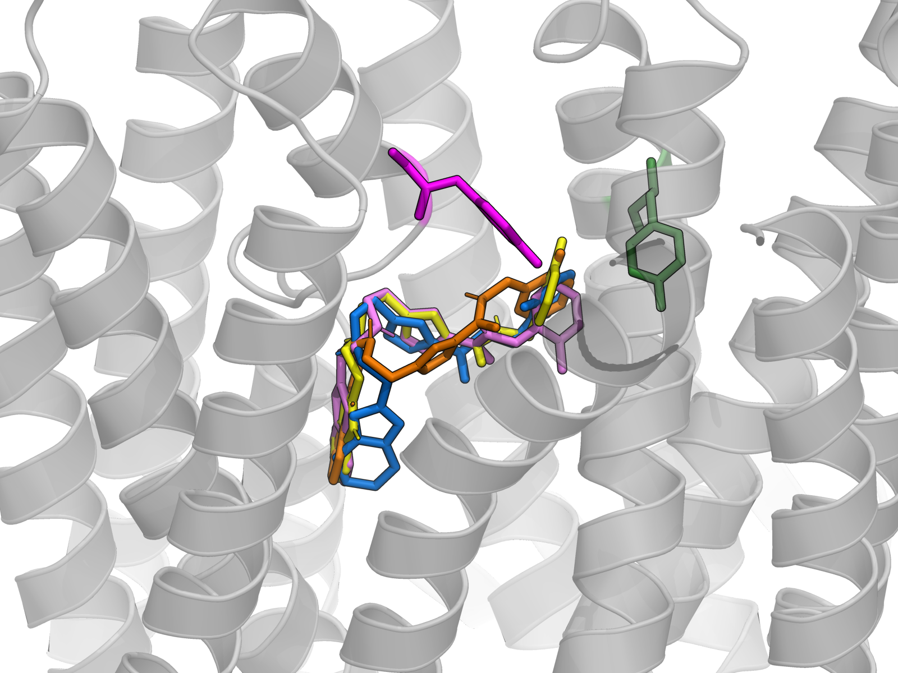

# SLC40A1 Ferroportin Inhibitor Workflow Report

## Core question

Can vamifeport-like small molecules preserve a plausible inhibitor-like binding mode in the ferroportin mutants `C326Y` and `Y64N`, with particular emphasis on mutation tolerance in `C326Y`?

## How to use this project package

All paths below are repository relative. The most important files for a new reader are listed first.

| Location | Purpose |
|---|---|
| `report/workflow_results_report.qmd` | main technical report |
| `report/figures/workflow.png` | workflow overview figure |
| `report/figures/WT_C326Y_Y64N.png` | structural comparison panel for `WT`, `C326Y`, and `Y64N` |
| `report/figures/validation_pose_overlay.png` | WT validation figure showing the bound and redocked vamifeport poses |
| `report/figures/analog_modification_pairs.png` | analog design overview |
| `report/figures/top_ranked_analog_panel.png` | top-ranked analog structures |
| `report/figures/c326y_top_hits_overlay.png` | structural overlay of the best `C326Y` docked poses |
| `results/tables/final_ranked_hits.csv` | final cross-state ligand ranking |
| `results/tables/analog_cross_state_summary.csv` | per-state analog summary used for ranking |
| `results/tables/analog_library_manifest.csv` | exact analog identities and design rationale |
| `results/tables/cross_state_benchmark_summary.csv` | parent benchmark across `WT`, `C326Y`, and `Y64N` |
| `results/tables/production_receptor_minimization_summary.csv` | restrained minimization summary for the production receptors |
| `results/tables/redocking_setup_sweep_summary.csv` | WT redocking validation and box-optimization summary |
| `scripts/` | reproducible workflow scripts |
| `report/README.md` and `README.md` | directory-level orientation notes |

The directory layout is intentionally split by function:

| Directory | Contents |
|---|---|
| `config/` | locked box definitions, study manifest, and Vina configuration files |
| `data/raw/` | downloaded starting structures |
| `data/prepared/` | cleaned receptors and ligands used in docking |
| `data/reference/` | variant table, structure table, and analog design table |
| `results/tables/` | quantitative summaries used in the report |
| `results/docking/` | pose files and docking logs |
| `scripts/` | reproducible analysis scripts and visualization scenes |
| `report/figures/` | slide-ready figures used in this report |

The repository was slimmed before sharing. Full per-mode docking intermediates were not retained when they were redundant with the summary tables and representative best-pose files. The retained docking outputs are the ones needed to support this report, the PyMOL figure scenes, and direct inspection of the shortlisted ligands.

## Workflow overview

The workflow was designed as a controlled sequence rather than a broad docking screen. Each stage depends on the previous stage being defensible.

{fig-cap="Workflow overview. The project starts from the experimental `8C03` vamifeport-bound ferroportin structure, builds mutant receptor states, validates WT docking, prepares restrained production receptors, benchmarks the parent scaffold, constructs a focused analog library, and ranks ligands with `C326Y` prioritized as the hardest mutant state." width=100%}

## Structural basis and receptor states

Three structures were used for distinct roles.

| Structure | Role in project | Why it was used |
|---|---|---|
| `8C03` | primary docking template | experimental vamifeport-bound ferroportin structure |
| `6WBV` | mechanistic background reference | hepcidin-bound ferroportin state |
| `8DL7` | comparator reference | PR73-bound ferroportin state |

The actual docking work was built around `8C03` because it provides the only directly relevant experimental small-molecule pose for this project.

The three receptor states used in the workflow were:

| State | Role |
|---|---|
| `WT` | mechanistic anchor and control state |
| `C326Y` | primary mutant stress test |
| `Y64N` | secondary mutant comparator |

The logic of the state selection was straightforward. `WT` provides the only experimentally anchored inhibitor interaction pattern. `C326Y` is the main mutation used to stress the scaffold. `Y64N` tests whether the observed behavior is broader than a single mutant case.

## Mutant model construction

The mutant receptors were built from `8C03` with `pdbfixer` using `scripts/build_mutant_models.py`. The exact models written were:

| Output file | Mutation |
|---|---|
| `data/prepared/proteins/8C03_WT_receptor.pdb` | none |
| `data/prepared/proteins/8C03_C326Y_receptor.pdb` | `CYS-326-TYR` |
| `data/prepared/proteins/8C03_Y64N_receptor.pdb` | `TYR-64-ASN` |

Residue numbering was taken directly from the deposited `8C03` chain A coordinates. In that deposited structure, residue `64` is `TYR` and residue `326` is `CYS`, so the mutant names `Y64N` and `C326Y` map directly onto the author numbering in the PDB file.

Important implementation choices were:

1. heterogens and water were removed before writing receptor-only models
2. unresolved loops were not rebuilt, because the aim was to preserve the experimental `8C03` backbone rather than invent missing segments
3. missing side-chain atoms were added only where needed after mutation

This keeps the comparison controlled. All three states start from the same parent backbone, so the intended difference is the mutation itself rather than unrelated structural drift.

### Local geometry repair

Two mutation-specific corrections were required during preparation.

For `C326Y`, the first mutant model lacked the Tyr aromatic side chain. The workflow was updated so that missing side-chain atoms were explicitly added after mutation.

For `Y64N`, the initial Asn side chain geometry placed `ND2` too close to `CB`, which caused obviously incorrect bond perception during visualization. A custom repair step in `repair_y64n_geometry()` repositioned `OD1` and `ND2` using the original `TYR64` side-chain directions and standard amide bond lengths.

The mutation-modeling stage therefore ended with receptor files that were visually and chemically interpretable before docking began.

{fig-cap="Prepared structural comparison panel for the three receptor states. The panel highlights the local environment around vamifeport together with residues 64 and 326, which define the `Y64N` and `C326Y` perturbations used in the project." width=100%}

## WT docking validation

The validation stage asked one question:

Can the docking workflow reproduce the known vamifeport pose in `8C03` before any analog ranking is attempted?

### Reference ligand extraction and initial box definition

The reference ligand `SZU` was extracted from `8C03` and written to:

| File | Role |
|---|---|
| `data/prepared/ligands/8C03_SZU_bound_reference.pdb` | structural reference pose |
| `data/prepared/ligands/8C03_SZU_bound_reference.sdf` | chemistry exchange format |
| `data/prepared/ligands/8C03_SZU_bound_reference_H.sdf` | hydrogenated ligand preparation intermediate |

The initial WT validation box was derived from the bound ligand coordinates. This ensured that the search space was centered on the experimentally occupied cavity rather than on an arbitrary pocket guess.

### Ligand-state panel

Before locking the validation workflow, four ligand states were tested:

| State | Formal charge | Comment |
|---|---:|---|
| `current_neutral` | 0 | chemically plausible control |
| `current_linker_protonated` | +1 | chemically plausible cationic state |
| `alt_tautomer_neutral` | 0 | alternative tautomer branch |
| `alt_tautomer_linker_protonated` | +1 | protonated alternative tautomer branch |

The state-panel results are in `results/tables/redocking_state_panel_summary.csv`.

The important outcome was that the linker-protonated state gave the best chemically credible pose recovery, while the alternative tautomer branch was dropped because it was not a persuasive working state for this scaffold. This left `current_linker_protonated` as the locked ligand state for the remainder of the workflow.

### Box and exhaustiveness sweep

Validation was then refined with a small sweep of box size and exhaustiveness using `scripts/optimize_redocking_setup.py`.

| Sweep parameter | Values tested |
|---|---|
| box scale | `1.00`, `0.92`, `0.84` |
| exhaustiveness | `16`, `32`, `64` |

The sweep summary is in `results/tables/redocking_setup_sweep_summary.csv`.

The final validation setup was:

| Parameter | Value |
|---|---|
| box center | `116.591, 120.154, 122.152` |
| box size | `15.12 x 15.12 x 18.766` |
| exhaustiveness | `16` |
| ligand state | `current_linker_protonated` |

The selected configuration was `box_084_ex16` because it gave a top-ranked pose RMSD of `2.084 Å`, full reference contact recovery of `1.0`, and a top pose that collapsed onto the same result as the best-recovered pose. This was a strong enough validation result to proceed without further tuning.

{fig-cap="WT docking validation. The bound vamifeport pose from `8C03` is overlaid with the validated redocked pose using the final optimized WT box. This figure is the main visual check that the docking setup can reproduce the known inhibitor binding mode before any analog ranking is attempted." width=100%}

## Contact definition and recovery metric

The docking workflow did not use full PLIP-style interaction typing as the main ranking metric. Instead, it used a simpler residue-contact recovery definition.

The reference contact shell was defined from the WT bound ligand as any receptor residue with at least one heavy atom within `4.0 Å` of any heavy atom of the bound reference ligand.

For each docked pose, the same `4.0 Å` heavy-atom test was applied. A residue counted as recovered if it remained part of that same WT reference contact shell. Therefore,

\[
\text{reference contact recovery} =
\frac{\text{number of recovered WT reference residues}}
{\text{number of WT reference residues}}
\]

This metric answers a specific question:

Which residues from the experimentally observed WT inhibitor contact shell are still contacted by the docked pose?

This is intentionally coarser than PLIP. It does not classify hydrogen bonds, pi interactions, or salt bridges. It only measures residue-level contact-shell conservation. That simplification is robust enough for a broad docking panel and avoids overinterpreting early-stage docking geometries.

## Production receptor preparation and restrained minimization

The validated WT receptor used for redocking was not reused directly for the final WT versus mutant comparison. Instead, a separate production receptor set was built for all three states using `scripts/prepare_production_receptors.py`.

### Why a second receptor set was necessary

The mutant side chains were modeled rather than experimental, so local cleanup was needed before comparing docking behavior across states. At the same time, unconstrained relaxation would have weakened the link to the experimental `8C03` pocket geometry. The compromise was restrained minimization.

### Minimization protocol

The production receptor script used:

| Parameter | Value |
|---|---|
| force field | `amber14/protein.ff14SB.xml` |
| implicit solvent | `implicit/gbn2.xml` |
| pH for hydrogenation | `7.4` |
| heavy-atom restraint | `1000 kJ mol^-1 nm^-2` |
| integrator | Langevin |
| temperature | `300 K` |
| friction | `1.0 ps^-1` |
| timestep | `0.002 ps` |
| minimization iterations | `1500` |

Heavy atoms were restrained by default. Side chains in the reference pocket residue set were allowed to relax, while backbone atoms remained restrained even in flexible residues. Residue `326` was explicitly included in the flexible set because it is the central mutation site in `C326Y`.

### Production receptor outputs

The production files were written to `data/prepared/proteins/production/`. The main summary is in `results/tables/production_receptor_minimization_summary.csv`.

| State | Heavy-atom RMSD after minimization (Å) | Final potential energy (kJ/mol) | Restrained heavy atoms | Flexible side-chain heavy atoms |
|---|---:|---:|---:|---:|
| `WT` | `1.048` | `-22659.97` | `3200` | `101` |
| `C326Y` | `1.044` | `-22463.60` | `3200` | `107` |
| `Y64N` | `1.045` | `-22436.39` | `3200` | `97` |

These RMSDs are consistent with local relaxation rather than global structural reorganization.

## Parent scaffold benchmark across WT and mutants

Before generating analogs, the validated protonated parent ligand was docked into the production receptors using `scripts/run_cross_state_benchmark.py`.

The benchmark summary is in `results/tables/cross_state_benchmark_summary.csv`.

| State | Top pose RMSD (Å) | Top contact recovery | Best RMSD pose rank | Best RMSD (Å) | Best RMSD contact recovery |
|---|---:|---:|---:|---:|---:|
| `WT` | `3.376` | `0.75` | `9` | `0.966` | `0.875` |
| `C326Y` | `3.457` | `0.125` | `9` | `1.976` | `0.125` |
| `Y64N` | `3.200` | `0.625` | `12` | `2.175` | `0.5` |

This benchmark defined the design direction for the analog stage. `WT` still supports a reasonably native inhibitor-like pose, `Y64N` is perturbed but not catastrophic, and `C326Y` is the most disruptive state. That is why `C326Y` later became the dominant ranking priority.

## Analog library design

The first-round analog set was built with `scripts/build_analog_library.py`. The input design table is `data/reference/analog_designs.csv`, and the final manifest is `results/tables/analog_library_manifest.csv`.

The scaffold was treated as four editable regions:

1. headgroup
2. central core
3. protonated linker
4. distal fused heteroaryl tail

The design rule was one major edit per analog. That keeps interpretation simple because each ligand tests one structural hypothesis rather than several overlapping changes.

### Design rationale

The panel was designed as a small, hypothesis-driven SAR exercise rather than a broad virtual screen. The edits were chosen to test whether the headgroup fluorine is required, whether headgroup geometry is rigid or tunable, whether extra headgroup polarity helps in the mutants, whether the distal fused ring can be changed without breaking the scaffold, whether the distal NH donor matters, whether the linker NH donor matters, and whether a higher-risk core heteroatom swap remains viable.

### Bioisosteric logic

| Analog | Main edit | Bioisosteric or SAR idea |
|---|---|---|
| `H1_desfluoro` | remove F from headgroup | minimal electronics and lipophilicity test |
| `H2_pyrimidyl` | add one headgroup ring N | aza-aryl bioisostere to increase polarity |
| `H3_regiofluoro` | fluoropyridyl regioisomer | preserve composition while changing vector geometry |
| `T1_benzoxazole` | benzimidazole to benzoxazole | O-for-N fused heteroaryl swap and donor removal |
| `T2_benzothiazole` | benzimidazole to benzothiazole | S-for-N fused heteroaryl swap with greater polarizability |
| `T3_n_methyl_benzimidazole` | block distal NH donor | direct donor-removal control |
| `T4_aza_benzimidazole` | add one ring N in tail | fused aza-aryl polarity increase |
| `L1_tertiary_amine` | secondary to tertiary cationic linker | keep charge, remove NH donor |
| `C1_thiazole_core` | core O to S swap | higher-risk central heteroaryl electronics test |

The parent and analog structures were drawn with RDKit.

{fig-cap="Parent scaffold and single-region analog modifications used in the first-round library. Each analog was designed to test one main medicinal-chemistry hypothesis while preserving the overall scaffold architecture." width=100%}

## Analog docking panel

The full analog panel was docked into all three production receptors using `scripts/run_analog_docking_panel.py`.

The main outputs are:

| File | Purpose |
|---|---|
| `results/tables/analog_cross_state_pose_metrics.csv` | pose-level metrics for each ligand-state pair |
| `results/tables/analog_cross_state_summary.csv` | per-state best-recovery summary |
| `results/tables/final_ranked_hits.csv` | final cross-state ranking |
| `scripts/view_analog_ranked_hits_c326y.pml` | structural inspection scene for the best `C326Y` poses |

### Per-state pose selection

For each ligand in each state, the script tracked three pose summaries:

| Pose summary | Meaning |
|---|---|
| `top pose` | raw `vina` mode 1 pose |
| `best RMSD pose` | pose with the lowest RMSD to the WT bound reference |
| `best recovery pose` | pose selected for cross-state comparison |

The `best recovery pose` was chosen by the following priority:

1. highest reference contact recovery
2. lower RMSD
3. better docking score
4. better mode rank

This is the key design choice in the ranking stage. The workflow does not assume that the lowest-scoring pose is the biologically most relevant one. Instead, it asks:

Which pose best preserves the experimentally anchored WT inhibitor interaction pattern?

### Why WT remains the reference

The WT contact pattern is not the optimization target. It is the mechanistic anchor. The actual optimization target is mutation tolerance of a known inhibitor-like binding geometry.

Without the WT anchor, a mutant pose with a good score could still be an edge-binding artifact, a shallow off-pocket pose, or a geometry that no longer resembles the known inhibitor mechanism. The comparison is therefore not generic mutant versus WT docking. It is mutant tolerance of the experimentally grounded inhibitor contact shell.

## Final ranking logic

The final ranking was built from the per-state summaries.

### State support thresholds

A ligand was counted as supported in a given state only if all three conditions were met:

| Criterion | Threshold |
|---|---|
| reference contact recovery | `>= 0.875` |
| RMSD to WT bound reference | `<= 2.85 Å` |
| best recovery mode rank | `<= 10` |

These thresholds exclude poses that look reasonable only because a contact-rich conformation exists far down the ranked `vina` mode list.

### Final sort order

The final ligand ranking was sorted in this order:

1. number of supported states
2. whether `C326Y` is supported
3. `C326Y` contact recovery
4. `C326Y` mode rank
5. `Y64N` contact recovery
6. `WT` contact recovery
7. mean recovery across states
8. mean mode rank
9. mean RMSD
10. reference-versus-candidate tie break

This makes the ranking explicitly `C326Y`-prioritized, which follows directly from the parent benchmark.

## Final ranked results

The current ranking is in `results/tables/final_ranked_hits.csv`.

| Rank | Ligand | Main edit | Supported states | Assessment |
|---|---|---|---|---|
| 1 | `T2_benzothiazole` | tail | `WT, C326Y, Y64N` | broadly supported lead |
| 2 | `H3_regiofluoro` | headgroup | `WT, C326Y, Y64N` | broadly supported lead |
| 3 | `T1_benzoxazole` | tail | `WT, C326Y, Y64N` | broadly supported lead |
| 4 | `vamifeport` | none | `WT, C326Y, Y64N` | broadly supported benchmark |

### Quantitative summary of the top four

| Ligand | WT recovery / mode / RMSD | C326Y recovery / mode / RMSD | Y64N recovery / mode / RMSD |
|---|---|---|---|
| `T2_benzothiazole` | `1.0 / 2 / 2.62` | `1.0 / 1 / 2.65` | `1.0 / 4 / 2.69` |
| `H3_regiofluoro` | `1.0 / 4 / 2.44` | `1.0 / 3 / 2.82` | `1.0 / 1 / 2.45` |
| `T1_benzoxazole` | `1.0 / 1 / 2.59` | `1.0 / 8 / 2.72` | `1.0 / 9 / 2.16` |
| `vamifeport` | `1.0 / 7 / 2.60` | `0.875 / 6 / 2.17` | `1.0 / 10 / 2.48` |

{fig-cap="Top-ranked analogs from the first docking panel. The panel shows the most promising tail and headgroup edits that emerged after cross-state ranking with `C326Y` prioritized." width=75%}

{fig-cap="Docked best-recovery poses for the top-ranked ligands in the `C326Y` receptor state compared with the parent vamifeport scaffold. This figure is the main structural interpretation aid for the final ranking." width=100%}

## Interpretation of the ranked panel

### `T2_benzothiazole`

This ligand ranked first because it is the cleanest broad lead. It is supported in all three states, recovers the full WT reference contact shell in all three states, and its best `C326Y` pose is already mode `1`. The main interpretation is that the distal fused tail can be replaced by a sulfur-containing analog without breaking the parent binding logic and with improved tolerance in the hardest mutant.

### `H3_regiofluoro`

This is the best headgroup result. It is supported in all three states, shows strong `C326Y` support at mode `3`, and gives the strongest `Y64N` ranked support among the top candidates. This suggests that the fluoropyridyl region is not rigidly fixed in one orientation and that headgroup geometry is somewhat tunable.

### `T1_benzoxazole`

This ligand also supports all three states, but its mutant mode-rank behavior is weaker than `T2_benzothiazole`. It remains a good backup follow-up because it probes the same tail region with a different heteroatom logic.

### Parent `vamifeport`

The parent still ranks well and remains the correct benchmark. The key point is not that the parent fails. The key point is that at least some conservative analogs look more robust once cross-state mutant tolerance is prioritized.

## Why some analogs were downgraded

Several analogs produced superficially attractive recovery values but did not survive the mode-rank filter cleanly.

`H1_desfluoro` had full recovery values but its WT support pose appeared at mode `16`, so it was downgraded from broad support to a more mutant-focused result.

`L1_tertiary_amine` is mechanistically interesting because it keeps the cationic linker but removes the linker NH donor. However, its support in WT and `Y64N` was too deeply buried in the ranked list to treat it as a top follow-up ligand.

`T3_n_methyl_benzimidazole` gave a strong-looking `C326Y` recovery pose, but the relevant pose appeared too deep in the mode list for high confidence in a first-pass docking ranking.

These examples are exactly why the workflow included a mode-rank threshold and did not rank by docking score alone.

## How to interpret the current results

The current results should be interpreted as a docking-stage prioritization exercise, not as proof of inhibitor potency.

The strongest conclusions justified at this stage are:

1. the distal fused tail is a productive region for mutation-tolerance optimization
2. headgroup geometry is somewhat tunable
3. conservative analogs can outperform the parent scaffold under a `C326Y`-prioritized ranking scheme
4. `C326Y` remains the most useful discriminator for this series

The current results do not justify claims of experimental potency, target engagement, or therapeutic efficacy.

## Files to inspect after reading this report

The most useful next files for a team reader are:

| File | Why it matters |
|---|---|
| `results/tables/final_ranked_hits.csv` | final answer to the first-round ranking problem |
| `results/tables/analog_cross_state_summary.csv` | shows how each ligand behaved in each receptor state |
| `results/tables/analog_library_manifest.csv` | connects ligand IDs to actual structures and design logic |
| `results/tables/redocking_setup_sweep_summary.csv` | documents how WT validation was locked |
| `results/tables/production_receptor_minimization_summary.csv` | documents how the production receptors were prepared |
| `scripts/view_analog_ranked_hits_c326y.pml` | easiest way to inspect the top `C326Y` poses directly |
| `scripts/presentation_mutation_scenes.pml` | reusable scene file for the structural comparison panel |
| `scripts/presentation_validation_pose_overlay.pml` | reusable scene file for the validation figure |
| `scripts/presentation_c326y_top_hits_overlay.pml` | reusable scene file for the final overlay figure |

## Recommended next step

The most defensible short-list for the next stage is:

1. `T2_benzothiazole`
2. `H3_regiofluoro`
3. `T1_benzoxazole` as the backup comparator

These three give one strong tail-optimization direction and one strong headgroup-optimization direction. The natural next step is a short MD follow-up with the parent included as the benchmark comparator.
